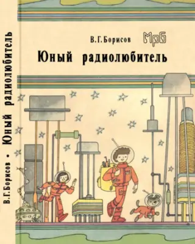

<!-- Ряд с фото -->

    
    

<!-- Стык в стык, без пустой строки -->
> **Библиографическое описание:**  
> Борисов В.Г. Энциклопедия юного радиолюбителя-конструктора / В. Г. Борисов. — 9. изд., перераб. и доп. — М.: Солон-Р, 2001. — 526 с.: ил. — ISBN 5-93455-100-0, ББК 32.84.
> 
> ---
> Борисов В.Г.-Юный радиолюбитель. (1992) {Борисов В.Г. Юный радиолюбитель. – 8-е издание, переработанное и дополненное. – М.: Радио и связь, 1992. – 416 с.: ил. – (Массовая радиобиблиотека; Вып. 1160)

Радиотехника и радиоэлектроника окружают нас повсюду: дома – это компьютеры и телефоны, в роверах, исследующих планеты, в самолетах и других летательных аппаратах – системы управления и радары. В аналоговом проектировании будущее связано с развитием радиочастотной связи. Инженеры-разработчики радиочастотных устройств очень востребованы в технологичном мире.

Радиосвязь особенно необходима там, где другая техника бессильна и требуется управление и контроль. Например, в космосе – для управления космическими аппаратами, а также для связи с дальними планетами. Чтобы понимать всё это и уметь создавать новые технологии, человеку нужны знания в области радиотехники и радиоэлектроники. 

В этом поможет книга [Борисова В.Г.](https://habr.com/ru/articles/393573/) – советского радиоинженера, автора многих изданий по организации детского технического творчества.

На фотографии версия книги [1992 года](http://publ.lib.ru/ARCHIVES/M/''Massovaya_radiobiblioteka''_(seriya)/_MRB_1100-1199_.html) и её переиздание [2001 года](http://publ.lib.ru/ARCHIVES/B/BORISOV_Viktor_Gavrilovich/_Borisov_V.G..html). 

Смотри также [другие материалы](https://).
