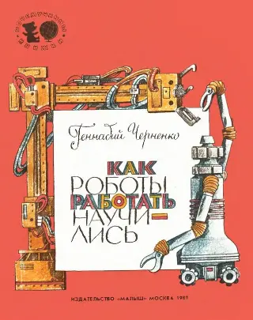
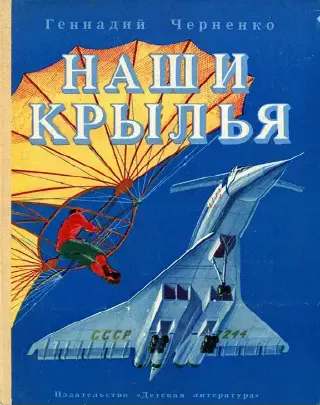
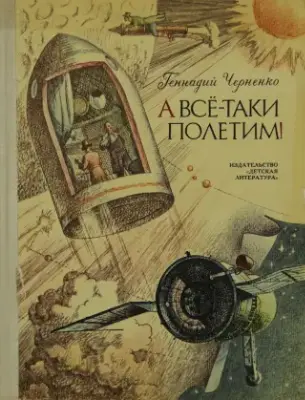
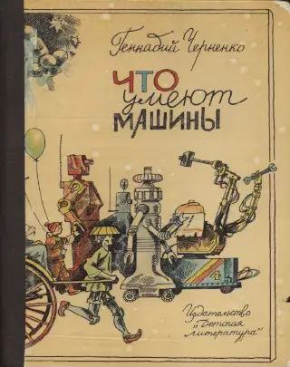
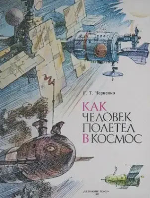
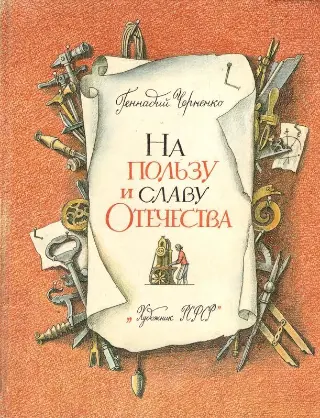
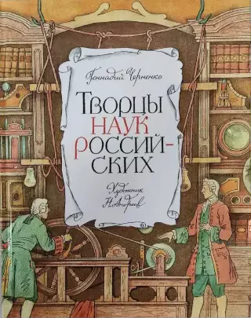
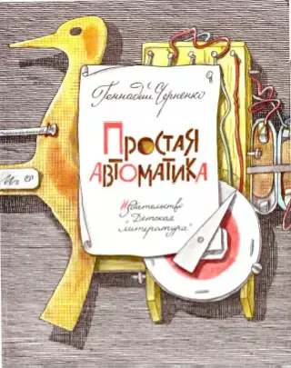
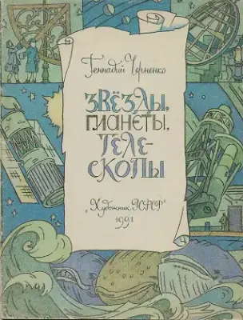

<!-- Ряд с фото -->

    
    

<!-- Стык в стык, без пустой строки -->
> **Библиографическое описание:**  
> Черненко Г.Т. Путешествие в страну роботов. Рассказы об автоматике. Рис. Ю. Клыкова. — Л.: Детская литература, 1977. — 96 с.: ил. — ISBN 5-08-000084-8. 

**Развитие инженерного мышления неразрывно связано с изучением научно-технической литературы**. Школьникам младшего и среднего возраста (1–4 класс) рекомендую читать произведения Геннадия Трофимовича Черненко. Он написал множество увлекательных инженерно-технических книг для любознательных ребят. **Прежде чем стать детским писателем, долгое время работал инженером, был исследователем**.

    
    
    
    
    
    
    
    

В 1977 году вышла его первая книга — *«Путешествие в страну роботов»*. Затем появились рассказы об авиации — *«Наши крылья»*, книга о космических конструкторах — *«А все-таки полетим!»*, о изобретателях прошлого — *«На пользу и славу Отечества»*, о первых ученых — *«Творцы наук российских»* и многие другие. Геннадий Черненко — автор около двух тысяч журнальных публикаций и [более тридцати книг](https://deti.spb.ru/writers_rus/cher_gt/list).

Книги в [электронном виде](http://publ.lib.ru/ARCHIVES/CH/CHERNENKO_Gennadiy_Trofimovich/_Chernenko_G.T..html); для чтения детьми предпочтителен бумажный вариант.

**Смотри также:** [материалы для самостоятельного изучения.](materialy-dlya-samostoyatelnogo-izucheniya-osnov-elektroniki.html)
