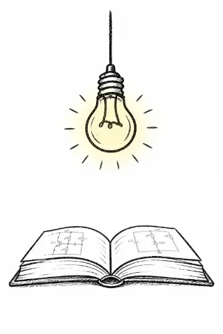
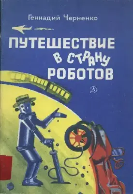
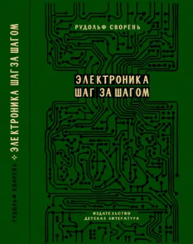
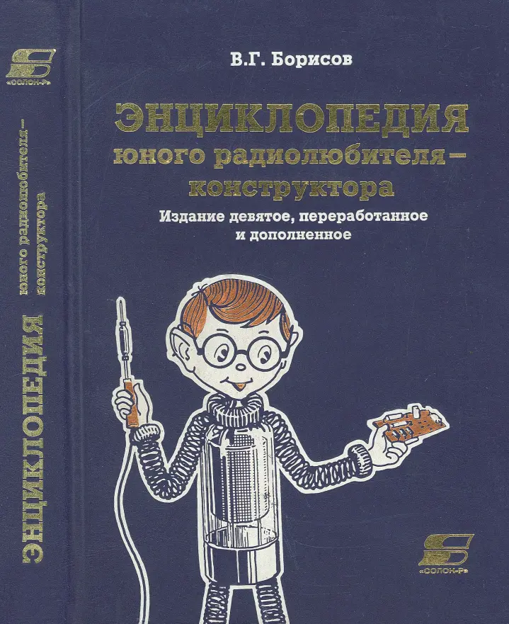
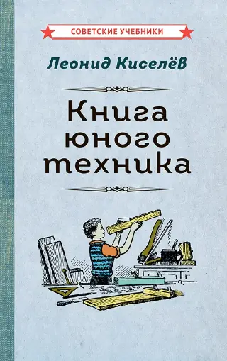
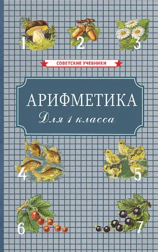
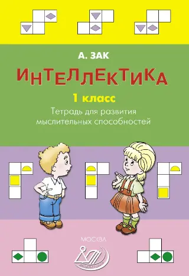
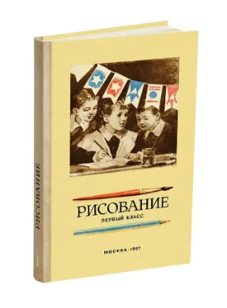

Рекомендуемые книги и учебники, проверенные временем и практикой.

<a href="materialy-dlya-samostoyatelnogo-izucheniya-osnov-elektroniki.html" class="biblio-card">
    
    

        <h3>Материалы для изучения основ электроники</h3>
        Первоначальный материал
        
Самостоятельное изучение основ электроники детьми 8-16 лет. Для овладения техническими знаниями практические занятия должны проводиться регулярно, не реже трёх раз в неделю по одному-два часа.

    

</a>

<a href="chernenko-g-t-puteshestvie-v-stranu-robotov-1977.html" class="biblio-card">
    
    

        <h3>Книги по автоматике и робототехнике</h3>
        Черненко Г.Т.
        
Введение в автоматику и робототехнику. Первые шаги в изучении механизмов и систем управления. Развитие инженерного мышления в младшем и среднем возрасте.

    

</a>

<a href="svoren-r-a-elektronika-shag-za-shagom-1991.html" class="biblio-card">
    
    

        <h3>Электроника шаг за шагом</h3>
        Сворень Р.А.
        
Фундаментальный курс практической электроники — от принципа работы до создания сложных электронных систем. Классика инженерной литературы.

    

</a>

<a href="borisov-v-g-enciklopediya-yunogo-radiolyubitelya-konstruktora-2001.html" class="biblio-card">
    
    

        <h3>Энциклопедия юного радиолюбителя</h3>
        Борисов В.Г.
        
Фундаментальные знания о радиосвязи, принципах работы электронных устройств и компонентов. Классика инженерной литературы.

    

</a>

<a href="kiselyov-l-kniga-yunogo-tekhnika-1948.html" class="biblio-card">
    
    

        <h3>Книга юного техника</h3>
        Киселёв Л.
        
Практическое руководство по техническому творчеству. Обучает основам работы с материалами, механикой и электроникой, вдохновляя на создание собственных изобретений своими руками.

    

</a>

<a href="pchyolko-a-s-arifmetika-dlya-nachalnoj-shkoly-1955.html" class="biblio-card">
    
    

        <h3>Книги по математике (арифметика)</h3>
        Пчёлко А.С., Попова Н.С., Киселев А.П., Березанская Е.С.
        
Фундаментальная база для инженерных расчетов. Советские учебники по арифметике, помогающие освоить «язык математики», необходимый для  проектирования и понимания работы электрических схем и цепей.

    

</a>

<a href="zak-a-z-intellektika-2024.html" class="biblio-card">
    
    

        <h3>Книги для развития мышления</h3>
        Зак А.З.
        
Развитие мыслительных способностей. Задачи на выработку навыков анализа и поиска решений, необходимых для проектирования собственных инженерных устройств.

    

</a>

<a href="rostovcev-n-n-risovanie-1957.html" class="biblio-card">
    
    

        <h3>Книги по рисованию</h3>
        Ростовцев Н.Н.
        
Основа визуализации и пространственного мышления. База для зарисовки схем, понимания чертежей и проектирования новых устройств.

    

</a>

