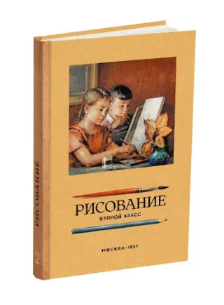
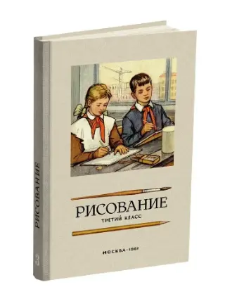
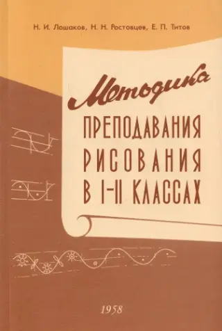

<!-- Ряд с фото -->

    
    
    
    
    

<!-- Стык в стык, без пустой строки -->
> **Библиографическое описание:**  
> Ростовцев Н.Н. Рисование. Первый класс. 1957 год.  — М.: Издательство «Наше Завтра», 2022. — 134 с. — ISBN 978-5-6047724-1-6.

Воображение развивается на основе чётких представлений о предметах и явлениях. Накопление таких представлений укрепляет образную и зрительную память. Всё это важно для инженерной и научно-исследовательской деятельности. Поэтому в **изучении электроники большое значение имеют навыки рисования**.

Процесс изображения помогает лучше понять предметы, которые раньше воспринимались только внешне: изучить их форму и детали. Он требует наблюдательности, постоянного внимания и развивает эти качества. Такие способности необходимы для творческого решения технических задач.

Навыки рисования нужны архитектору, инженеру, врачу, биологу, географу, геологу и многим другим. **Умение зарисовать** электронную схему и как она работает, детали машин или форму нового вируса **помогает в практической работе**. Понимание рисунков и чертежей облегчает изучение инструмента, станков, машин и сложных агрегатов.

На фотографии изображены книги 50–60-х годов в современном переиздании.

**Смотри также:** [материалы для самостоятельного изучения.](materialy-dlya-samostoyatelnogo-izucheniya-osnov-elektroniki.html)
