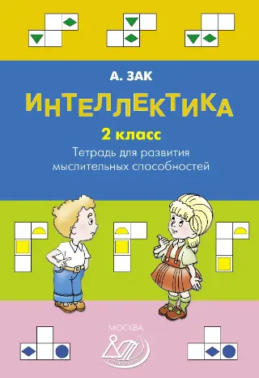
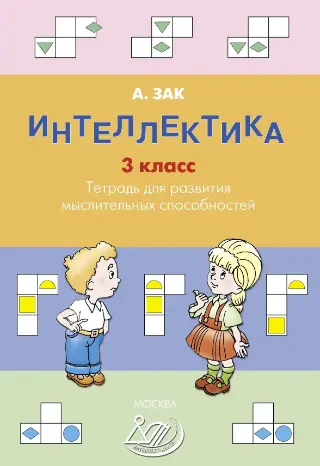
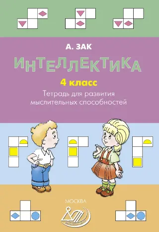

Чтобы разбираться в электронике, **важно не только владеть [арифметикой](https://eaststandart.github.io/biblio/pchyolko-a-s-arifmetika-dlya-nachalnoj-shkoly-1955.html) и знать, как работают схемы, но и понимать физические процессы**, которые в них происходят. Создание собственных электронных устройств требует развитого и гибкого мышления — умения анализировать, искать решения, придумывать новое.

Выработать такие навыки помогают **регулярные практические и творческие занятия**. Предлагаемая литература направлена на развитие мыслительных способностей и открывает путь к созданию ваших собственных, самостоятельно придуманных проектов по электронике.

**Смотри также:** [материалы для самостоятельного изучения.](materialy-dlya-samostoyatelnogo-izucheniya-osnov-elektroniki.html)
