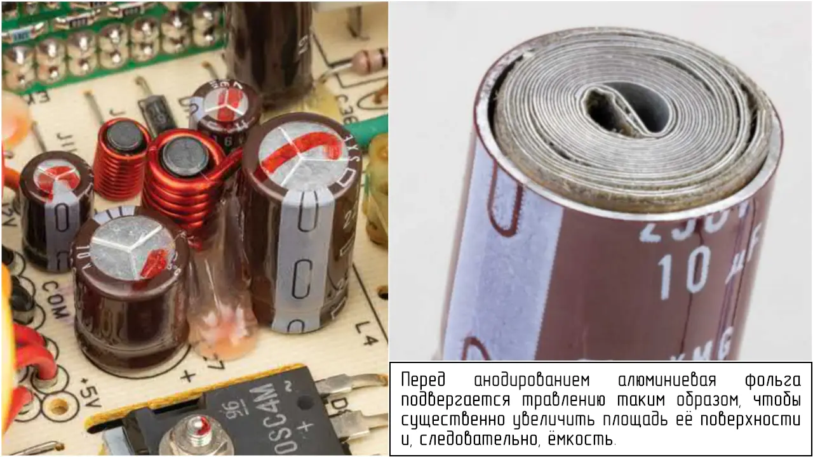

Алюминиевые электролитические конденсаторы (Aluminum Electrolytic Capacitor) обладают большой емкостью и компактными размерами, поэтому они широко используются в источниках питания. Металлический корпус заполнен электролитом — электропроводящей жидкостью. Электролит выполняет роль одной из проводящих обкладок конденсатора. Вторая обкладка представляет собой длинную, тонкую, свернутую полоску алюминиевой фольги, погруженную в электролит.

 

Алюминиевая фольга подвергается анодированию, в результате чего на ее поверхности образуется оксид алюминия, который действует как диэлектрик между фольгой и электролитом. Вторая свернутая полоска алюминиевой фольги, отделённая от первой бумажными прокладками, служит электродом, соединяющим электролит с проволочным выводом  (отрицательным) конденсатора.

Перед анодированием алюминиевая фольга подвергается травлению таким образом, чтобы существенно увеличить площадь ее поверхности и, следовательно, емкость.