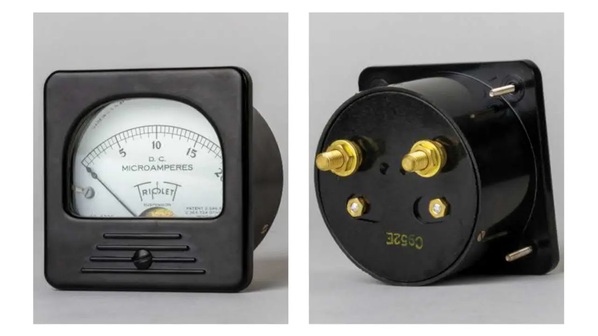
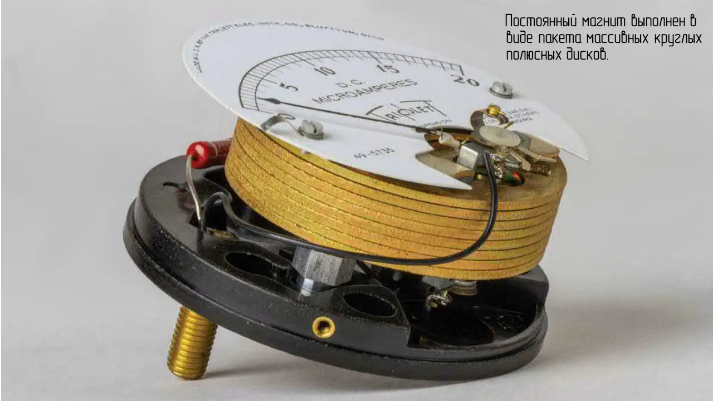
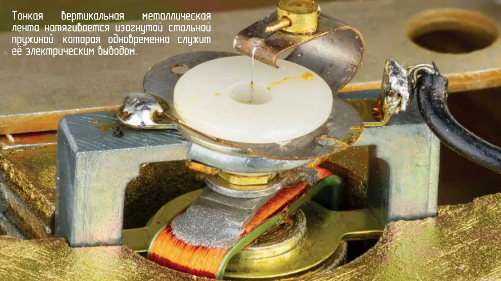

В годы, предшествовавшие широкому распространению дешёвых ЖК-панелей и светодиодных индикаторов, аналоговые приборы применялись для измерения напряжений и токов в самых разных областях.

Показанный здесь тип аналогового прибора содержит неподвижный постоянный магнит, который взаимодействует с электромагнитом и поворачивает его, тем самым вызывая отклонение прикреплённой стрелки.

Вращающийся электромагнит подвешен и опирается на две натянутые металлические ленты — одну сверху и одну снизу катушки. Эти ленты проводят электрический ток от клемм прибора к вращающейся катушке. Кроме того, они выполняют роль слабой торсионной пружины, возвращая стрелку к нулевому положению при уменьшении тока.

 

Угол отклонения стрелки точно определяется величиной тока, протекающего по медной обмотке электромагнита, и уравновешивается действием слабой пружины. Такой механизм называется [механизмом](https://ru.wikipedia.org/wiki/%D0%93%D0%B0%D0%BB%D1%8C%D0%B2%D0%B0%D0%BD%D0%BE%D0%BC%D0%B5%D1%82%D1%80#%D0%93%D0%B0%D0%BB%D1%8C%D0%B2%D0%B0%D0%BD%D0%BE%D0%BC%D0%B5%D1%82%D1%80_%D0%94%E2%80%99%D0%90%D1%80%D1%81%D0%BE%D0%BD%D0%B2%D0%B0%D0%BB%D1%8F) [д’Арсонваля](https://ru.wikipedia.org/wiki/%D0%94%E2%80%99%D0%90%D1%80%D1%81%D0%BE%D0%BD%D0%B2%D0%B0%D0%BB%D1%8C,_%D0%90%D1%80%D1%81%D0%B5%D0%BD).

Постоянный магнит выполнен в виде пакета массивных круглых полюсных наконечников.
Тонкая вертикальная металлическая лента натягивается изогнутой стальной пружиной, которая одновременно служит её электрическим выводом.
