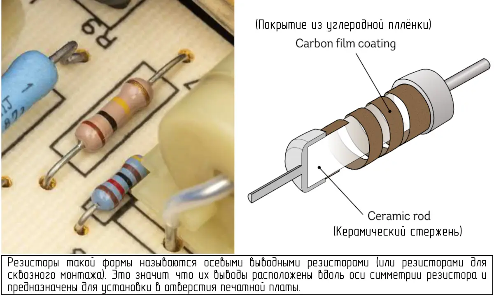
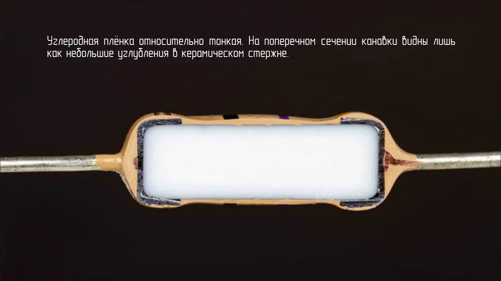
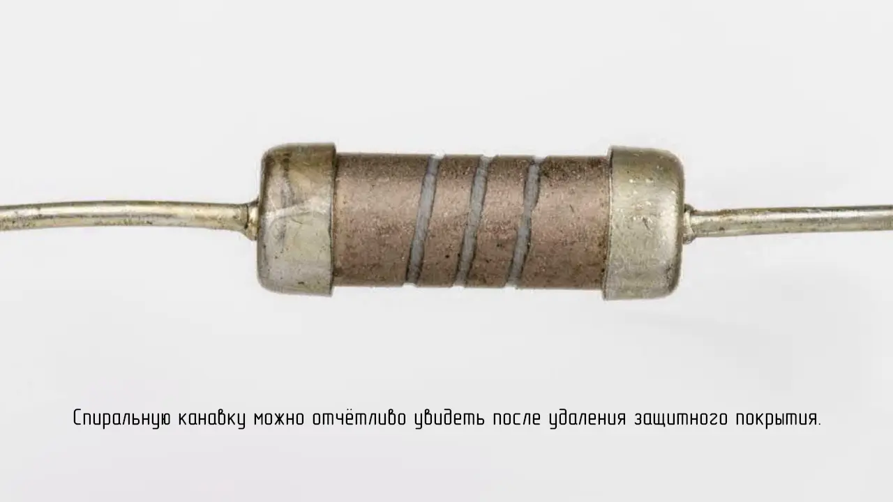

Резисторы — это устройства, которые ограничивают или регулируют поток электричества. Их используют везде, где требуется контролируемое количество тока в цепи. Обычные резисторы с углеродной плёнкой применяются в бытовой электронике, например, в приборах и игрушках, где важнее низкая стоимость, чем высокая точность или компактность.

 

Резистор изготавливается из керамического стержня, покрытого тонким слоем углеродной плёнки, проводящей электричество с определённым сопротивлением. В плёнке прорезают спиральную канавку, создавая длинный узкий проводящий путь из углерода, который закручивается вокруг стержня от одного конца к другому. На оба конца надевают металлические колпачки и припаивают проволочные выводы. Затем резистор покрывают защитным слоем и наносят цветные полосы, обозначающие номинал его сопротивления.

Резисторы такой формы называются осевыми выводными резисторами (или резисторами для сквозного монтажа). Это значит, что их выводы расположены вдоль оси симметрии резистора и предназначены для установки в отверстия печатной платы.

 
