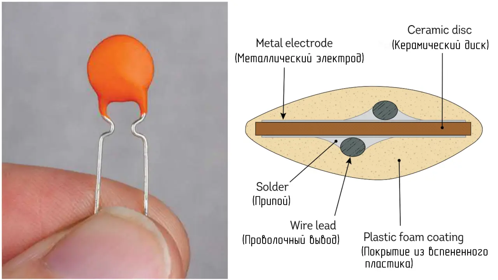
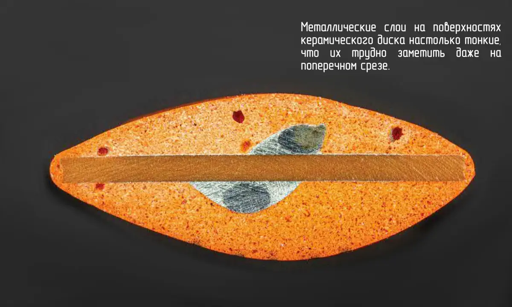
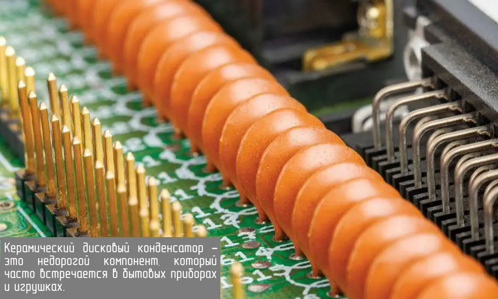

Конденсаторы — это основные электронные компоненты. Они хранят энергию в форме статического электричества и используются для накопления энергии, сглаживания электронных сигналов, в качестве ячеек компьютерной памяти и т.д. Простейший конденсатор состоит из двух параллельных металлических пластин с зазором между ними. Конденсаторы могут иметь множество форм, главное, чтобы они содержали две проводящие поверхности (электроды), разделенные изолятором.

 

В описываемом конденсаторе, изолятор представляет керамический диск, а две его параллельные пластины — тонкие металлические покрытия, нанесённые методом испарения или напыления на внешние поверхности диска. Выводы крепятся припоем, а затем вся конструкция погружается в материал покрытия. При высыхании он затвердевает и защищает конденсатор от повреждений.

  