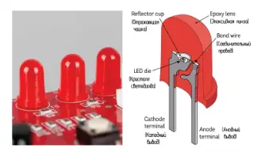

Моменты, которые помогают в техническом творчестве и инженерном поиске.

    <a href="our-dream.html" class="fair-card">
        
            <h3>Наша мечта ...</h3>
    </a>
        <a href="strontium-atom.html" class="fair-card">
        
            <h3>Атом в ионной ловушке</h3>
    </a>
        <a href="through-hole-red-led.html" class="fair-card">
        
            <h3>Красный светодиод</h3>
    </a>
        <a href="carbon-film-resistor.html" class="fair-card">
        
            <h3>Углеродный пленочный резистор</h3>
    </a>
        <a href="ceramic-disc-capacitor.html" class="fair-card">
        
            <h3>Керамический дисковый конденсатор</h3>
    </a>
    <a href="magnetic-buzzer.html" class="fair-card">
        
            <h3>Магнитный зуммер</h3>
    </a>
    <a href="link-to-post.html" class="fair-card">
        
            <h3>Краткое название идеи.</h3>
    </a>
    <a href="link-to-post.html" class="fair-card">
        
            <h3>Краткое название идеи.</h3>
    </a>
        <a href="link-to-post.html" class="fair-card">
        
            <h3>Краткое название идеи.</h3>
    </a>
        <a href="link-to-post.html" class="fair-card">
        
            <h3>Краткое название идеи.</h3>
    </a>
            <a href="through-hole-red-led.html" class="fair-card">
        
            <h3>Красный светодиод</h3>
    </a>
        <a href="link-to-post.html" class="fair-card">
        
            <h3>Краткое название идеи</h3>
    </a>
            <a href="through-hole-red-led.html" class="fair-card">
        
            <h3>Красный светодиод</h3>
    </a>
        <a href="link-to-post.html" class="fair-card">
        
            <h3>Краткое название идеи</h3>
    </a>

