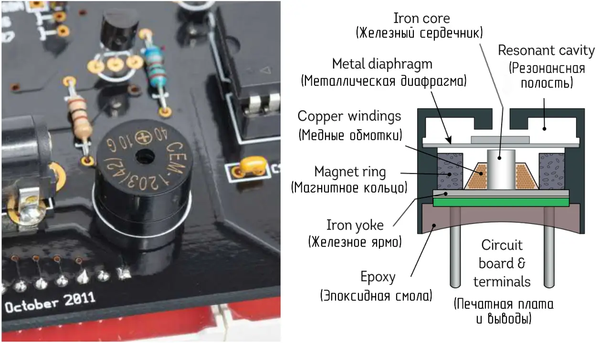
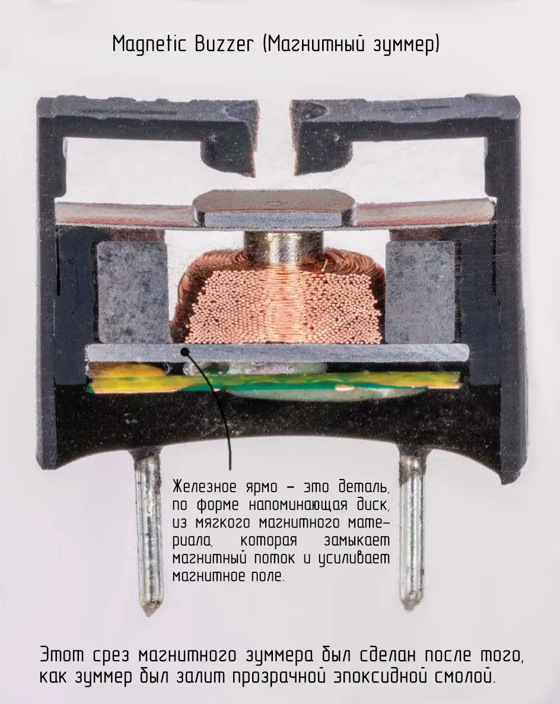

Многие виды оборудования используют магнитные зуммеры, чтобы издавать разные звуки: сигналы тревоги, информационные сигналы и даже простые мелодии, которые предупреждают вас, например, что рис в мультиварке уже готов. Материнская плата компьютера тоже использует магнитный зуммер, чтобы «сообщать» о возникновении неисправностей.

 

Внутреннее устройство этого компонента очень интересно. Самая заметная часть — маленький соленоид из медного провода, намотанного на железный сердечник. Когда на два выводных контакта подаётся ток, медная обмотка создаёт в сердечнике магнитное поле. Это поле взаимодействует с магнитным полем кольцевого магнита, расположенного вокруг катушки, и воздействует на металлическую мембрану в центре. Если на зуммер подать переменный сигнал, мембрана начинает вибрировать с частотой входного сигнала, создавая звук.

Этот срез магнитного зуммера был сделан после того, как зуммер был залит прозрачной эпоксидной смолой.

 

> Примечание: железное ярмо — это деталь, по форме напоминающая диск, из мягкого магнитного материала, которая замыкает магнитный поток и усиливает магнитное поле.
