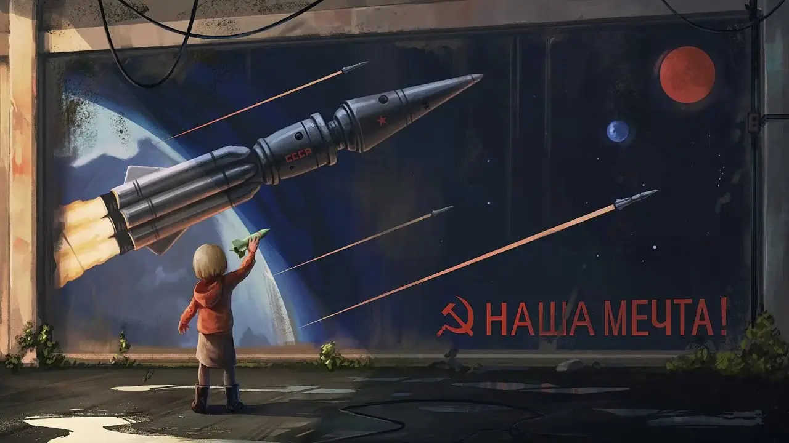

Для детей важна возможность и умение свободно мечтать. Когда человек мечтает, он понимает, чему нужно научиться, чтобы сделать мечту реальной. Когда-то люди мечтали о полётах в космос — и построили настоящие космические корабли, орбитальные станции и аппараты, которые смогли долететь до других планет. Эти Советские машины создавались не только из металла и теплоизоляции, но и из мечты. Поэтому раньше выходило так много книг о космосе, и даже появилась особая — «Космическая музыка». Сборник таких советских и российских мелодий называется «[Наша мечта](https://youtu.be/DMoCM_FgLP8)».

Сегодня мы тоже можем мечтать — и создавать. Пусть наши электронные устройства пока небольшие, но в каждом проводе, в каждой лампочке и в каждом сигнале живёт шаг к будущему. Так начинается путь инженера — с интереса, желания понять и сделать своими руками то, о чём когда-то мечтали люди.

