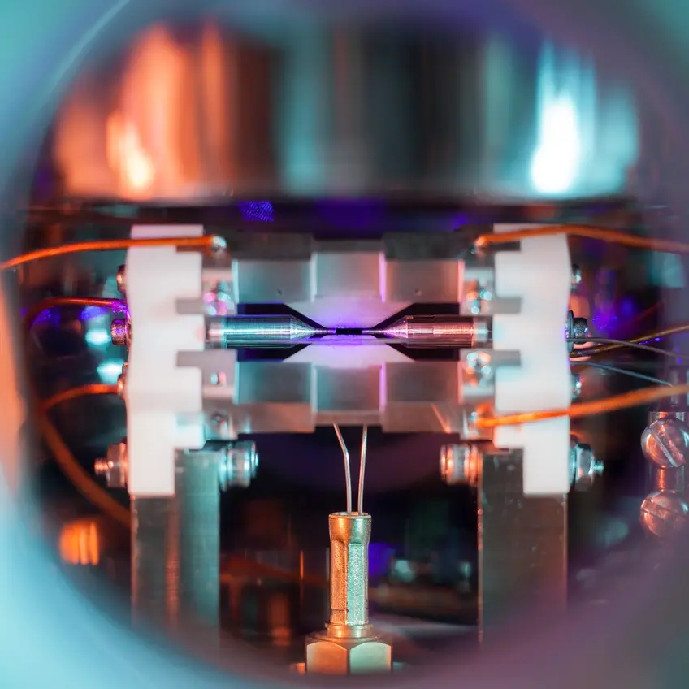
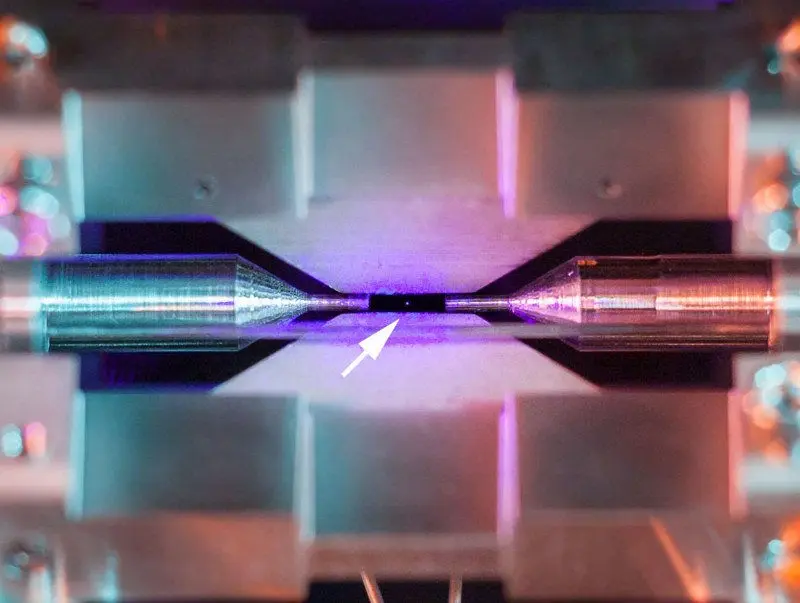

Фотография одиночного положительно заряженного атома стронция, удерживаемого электрическим полем, сделана Дэвидом Надлингером через окно вакуумной камеры в лаборатории Оксфордского университета с помощью обычной цифровой камеры. Два металлических электрода расположены на расстоянии двух миллиметров друг от друга. Они генерируют электрическое поле для удержания атома. Это нужно, чтобы освещать его сине-фиолетовым лазером. При подсветке лазером, атом, поглощает и повторно излучает частицы света (фотоны), а камера сумела зафиксировать это на длительной выдержке.

<!-- Стык в стык, без пустой строки -->
>  **Примечание:** атом стронция относительно велик (имеет диаметр равный 215 миллиардных долей миллиметра). На фотографии  можно «увидеть» атом лишь из-за того, что он поглотил и излучил вновь свет лазера. Этот процесс и был запечатлен. Поэтому фотография эта на самом деле – скорее след лазерного луча, нежели очертания самого атома. Без долгой выдержки атом не был бы виден невооруженным глазом.
