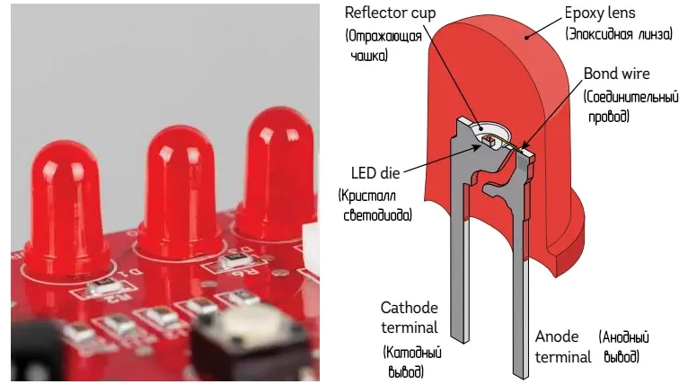

 

Постоянно притягательные и на удивление простые, светоизлучающие диоды (Light-Emitting Diodes) или светодиоды (LED), на самом деле имеют множество тонких конструктивных особенностей. Полупроводниковый кристалл в светодиоде изготавливается не из кремния, а из специального полупроводникового материала, который при работе излучает свет нужного цвета. Для красных светодиодов обычно используется AlGaAs (арсенид алюминия и галлия).

Необычная форма металлических выводов и тонкие насечки на них помогают надёжно зафиксировать контакты внутри эпоксидного корпуса и позволяют сгибать их, не повреждая хрупкий кристалл. Больший по размеру вывод — катод — имеет форму отражающей чашки под кристаллом, чтобы направлять свет вперёд. Тончайшая проволока соединяет меньший вывод — анод — с верхней поверхностью кристалла.

