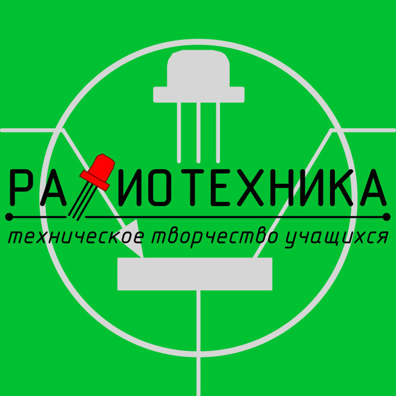

Это описание проекта, написанное на **Markdown**. Теперь оно выглядит красиво, потому что использует шаблон из папки `_layouts`.

### Что можно добавить:
* Списки компонентов.
* Схемы (просто вставьте картинку).
* Код программы.

Вот пример вставки кода для Arduino:
`void setup() { pinMode(13, OUTPUT); }`

[Вернуться на главную](index.html)
