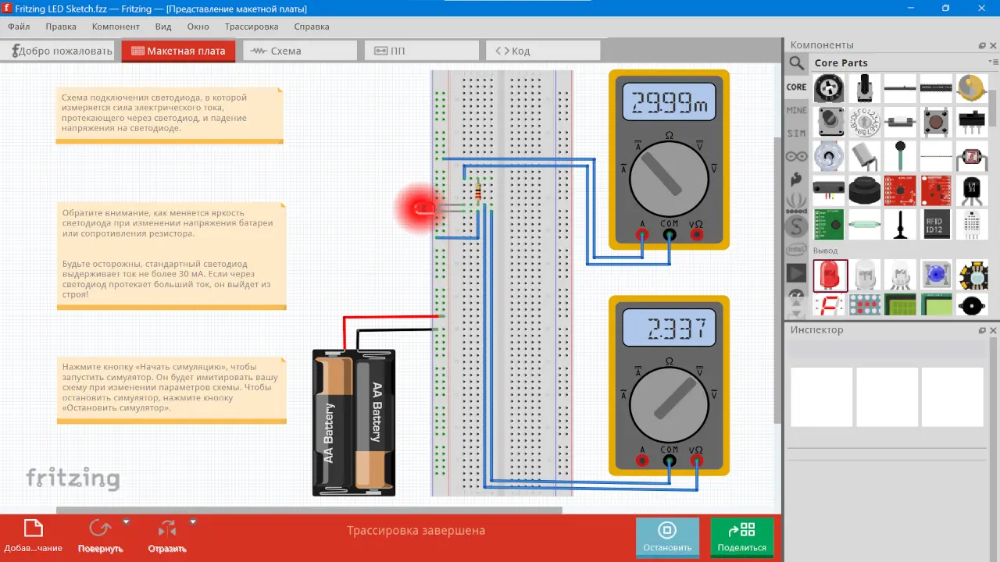

**Fritzing** – САПР для проектирования и документирования электронных схем, а также разводки печатных плат.

Программа полезна для обучения электронике, создания Arduino-проектов и BEAM-роботов, подготовки инструкций, статей и иллюстраций к учебным материалам по основам электроники. Её главное преимущество в возможности отображать схему так, как она реально выглядит на [макетной плате](https://blog.fritzing.org/2009/12/02/paper-templates-for-your-breadboard-prototypes), что особенно удобно для начинающих.

Программа доступна для освоения детьми по направлению «Электронное конструирование» и подобных, где требуется простое и быстрое создание прототипов электронных схем на макетной плате и проверка их работоспособности.

В программе спроектирована схема подключения светодиода (смотри фотографию), в которой измеряется сила электрического тока, протекающего через светодиод, и падение напряжения на нем (смотри файл [fritzing-led-sketch.fzz](fritzing-led-sketch.fzz). Для просмотра файла в Fritzing необходимо скачать файл [Fritzing 1.0.5 (Retail version.).msi](files/Fritzing 1.0.5 (Retail version.).msi) на компьютер и запустить его, а затем в программе открыть просматриваемый файл.

Множество примеров проектов содержится в меню программы – Файл > Открыть пример.
