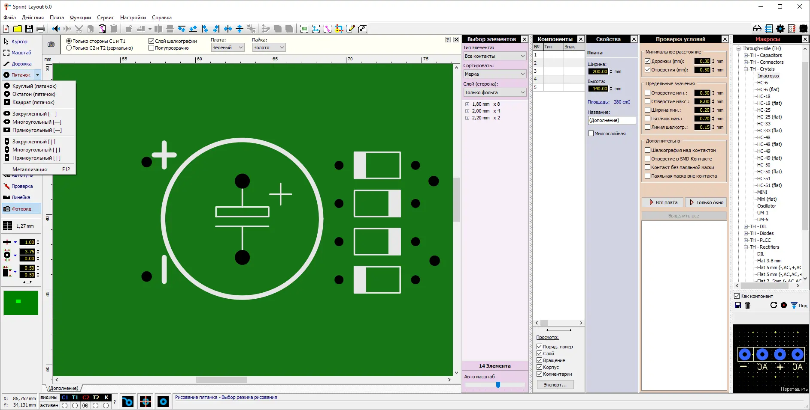

Sprint Layout  – САПР (Система Автоматизированного Проектирования) для проектирования и ручной разводки печатных плат малой и средней сложности.

Программа доступна для освоения детьми по направлению «Электронное конструирование» и подобных, где требуется простое и быстрое создание печатных плат.

В программе спроектированы печатные платы для ряда устройств, например, для проекта «Электронное пианино» (смотри файл [pianino-elektronnoe-proekt-uchebnyj.lay6](files/pianino-elektronnoe-proekt-uchebnyj.lay6)).

