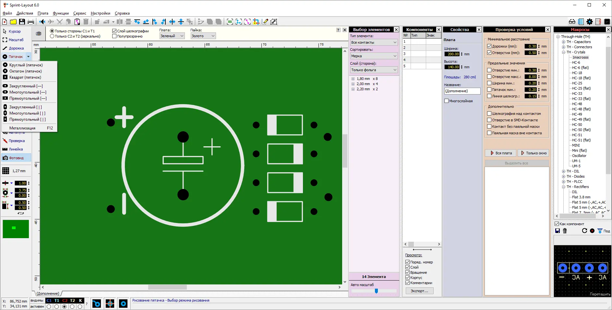

**Sprint Layout** – САПР (Система Автоматизированного Проектирования) для проектирования и ручной разводки печатных плат малой и средней сложности.

Программа доступна для освоения детьми по направлению «Электронное конструирование» и подобных, где требуется простое и быстрое создание печатных плат.

В программе спроектированы печатные платы для ряда устройств, например, для проекта «Электронное пианино» (смотри файл [pianino-elektronnoe-proekt-uchebnyj.lay6](files/pianino-elektronnoe-proekt-uchebnyj.lay6)). Для просмотра файла в SprintLayout необходимо скачать архив [sprintlayout.zip](files/sprintlayout.zip) на компьютер и распаковать его, запустить файл layout60.exe, а затем в программе открыть просматриваемый файл.

>  **Примечание.** для установки библиотеки (уже нарисованных) электронных компонентов (макросов) к программе SprintLayout требуется скачать архив [sprintlayout_macros.zip](files/sprintlayout_macros.zip) на компьютер и распаковать его. Скопировать/переместить папку MACROS в папку, где находится программа SprintLayout (файл layout60.exe). Далее запустить файл layout60.exe и перейти в меню Файл > Рабочие каталоги > Библиотека макросов. Затем нажать кнопку «Изменить» и выбрать путь к папке (MACROS) библиотеке макросов.
